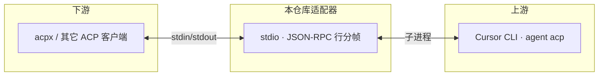

# fzx-cursor-acp

[](https://github.com/limingfa/fzx_cursor_acp)
[](https://www.npmjs.com/package/fzx-cursor-acp)
[](./LICENSE)
[](https://nodejs.org/)

|  |  |
| --- | --- |
| **仓库** | [github.com/limingfa/fzx_cursor_acp](https://github.com/limingfa/fzx_cursor_acp) |
| **npm 包** | [`fzx-cursor-acp`](https://www.npmjs.com/package/fzx-cursor-acp) |
| **问题反馈** | [Issues](https://github.com/limingfa/fzx_cursor_acp/issues) |

---

## 新手必读

**本仓库是做什么的？** 这是一个 **「中间人」程序**：让 [acpx](https://www.npmjs.com/package/acpx) 等 **ACP 客户端** 能通过标准输入输出，和本机上的 **Cursor 命令行（`agent` / `cursor-agent` 的 ACP 模式）** 对话。没有它，acpx 里的 **`cursor`** harness 无法直接驱动 Cursor CLI。

**你需要先接受这三点：**

| 必须项 | 说明 |
| --- | --- |
| **① 安装 Cursor CLI** | 本适配器会 **启动** `agent acp` / `cursor-agent acp`。只装 Cursor 编辑器、不装 CLI，通常 **无法工作**。终端里能执行 `agent --version` 或 `cursor-agent --version` 才算就绪。 |
| **② 先登录（或等价鉴权）** | Cursor CLI 执行任务需要账号能力。请执行 **`agent login`**，或按 [Cursor 文档](https://cursor.com/docs) 配置 **API Key / Token**（如 `CURSOR_API_KEY`）。**不登录**时，进程有时能起来，但容易在鉴权、执行任务时失败。 |
| **③ 安装本适配器** | 通过 **`npm install -g fzx-cursor-acp`** 或 **`npx -y fzx-cursor-acp@latest`**，并在 **`~/.acpx/config.json`** 里把 **`agents.cursor.command`** 指到该命令（见下文）。 |

**和「Cursor 编辑器里的 Agent 面板」不是同一条线：**  
OpenClaw / acpx 走的是 **命令行里的 Cursor（CLI）**，任务在 **子进程** 里跑；**不会自动显示**在你打开的 Cursor IDE 的 Agent 窗口里。要看执行情况，请看 **OpenClaw / acpx 侧输出**，或给适配器设 **`LOG_LEVEL=debug`**（日志在 **stderr**）。

---

## 目录

- [新手必读](#新手必读) · [常见问题（FAQ）](#常见问题faq)
- [工作原理](#工作原理)
- [功能特性](#功能特性)
- [快速开始（源码开发）](#快速开始源码开发)
- [通过 npm 安装与 acpx 配置](#通过-npm-安装与-acpx-配置)
- [前置条件（Cursor CLI 路径）](#前置条件cursor-cli-路径)
- [与 acpx 集成](#与-acpx-集成)
- [第一次使用 acpx cursor sessions new](#第一次使用-acpx-cursor-sessions-new)
- [在 OpenClaw 中引入](#在-openclaw-中引入)
- [可选配置](#可选配置)
- [验收脚本（Windows）](#验收脚本windows)
- [故障排查](#故障排查)
- [许可与贡献](#许可与贡献)
- [联系与作者](#联系与作者)

---

## 常见问题（FAQ）

**Q：只用 ACP / acpx，不装 Cursor CLI 可以吗？**  
不可以。适配器 **必须** 能拉起 **Cursor CLI**；否则没有上游，无法完成真实对话与任务。

**Q：不登录能用吗？**  
不建议。未登录时上游常无法稳定执行；请先 **`agent login`** 或按文档配置 API Key。

**Q：通信是指什么？**  
- **acpx ↔ 本适配器**：本机进程间 **stdio + JSON-RPC**，不经过互联网「连 Cursor」的那一步。  
- **Cursor CLI ↔ Cursor 服务**：需要 **有效登录态**，否则容易失败。

**Q：为什么在 OpenClaw 里调了 Cursor，IDE 里看不到？**  
那是 **CLI 会话**，不是 **IDE 里点的 Agent**。两边默认不共享同一块 UI。

**Q：OpenClaw 里 `/acp spawn` 报错？**  
必须带 harness 名：**`/acp spawn cursor`**；或配置 **`acp.defaultAgent`**（以 OpenClaw 文档为准）。

---

## 工作原理



- **协议：** JSON-RPC 2.0，按行写入 **stdout**；**日志只写 stderr**，避免污染 ACP 流。  
- **职责：** 会话映射、权限策略、上游崩溃重启等；**不替代** Cursor CLI 的安装与登录。

---

## 功能特性

- stdio + JSON-RPC 2.0 行分帧桥接  
- `cursor-agent acp` / `agent acp` 自动探测（可用 `--cursor-command` 覆盖）  
- `session/request_permission` 自动策略决策  
- 会话 ID 映射与本地持久化  
- 上游进程退出自动重启  
- Windows / macOS 下对 Cursor CLI **常见安装路径** 的补充探测（仍建议保证 **PATH** 或显式配置）

---

## 快速开始（源码开发）

```bash
git clone https://github.com/limingfa/fzx_cursor_acp.git
cd fzx_cursor_acp
npm install
npm run build
node dist/main.js
```

开发模式示例：

```bash
npm run dev -- --cursor-command agent --permission-mode approve-reads
```

---

## 通过 npm 安装与 acpx 配置

**环境：** **Node.js ≥ 18**；并已满足 [前置条件](#前置条件cursor-cli-路径)（Cursor CLI + 登录）。

```bash
npm install -g fzx-cursor-acp
```

在 **`~/.acpx/config.json`**（Windows 上多为 `C:\Users\你的用户名\.acpx\config.json`）中配置 **`agents.cursor.command`**：

**方式 A — 全局安装（命令短）**

```json
{
  "agents": {
    "cursor": {
      "command": "fzx-cursor-acp"
    }
  }
}
```

**方式 B — 不全局安装，用 npx（推荐在 OpenClaw/服务环境 PATH 不完整时尝试）**

```json
{
  "agents": {
    "cursor": {
      "command": "npx -y fzx-cursor-acp@latest"
    }
  }
}
```

**重要：** acpx 只认 **`command` 这一整段字符串**，**不要**指望单独的 `args` 字段（多数版本不读）。

**OpenClaw / 后台服务** 往往没有 `%AppData%\npm`，但通常有 **Node**，此时 **`npx -y fzx-cursor-acp@latest`** 往往比裸写 `fzx-cursor-acp` 更稳。

---

## 前置条件（Cursor CLI 路径）

1. 终端能执行 **`agent --version`** 或 **`cursor-agent --version`**。  
2. 已 **`agent login`**（或 API Key 等，见 Cursor 官方文档）。  
3. 若仍找不到命令：在 **`~/.cursor-acp-adapter.json`**（用户目录或项目根）中配置 **`cursor.command`** 为 **可执行文件绝对路径**。

**自动探测（不写 `cursor.command` 时）：**

- 先在 **`PATH`** 里找 `cursor-agent` / `agent`。  
- **Windows：** 再试 `%LOCALAPPDATA%\cursor-agent\cursor-agent.cmd`、`agent.cmd`。  
- **macOS：** 再试 `/opt/homebrew/bin`、`/usr/local/bin`、`~/.local/bin` 下的同名可执行文件。  
- 装在其他位置时，请 **手动配置** `cursor.command`。

**Windows 手动配置示例：**

```json
{
  "cursor": {
    "command": "C:/Users/你的用户名/AppData/Local/cursor-agent/cursor-agent.cmd"
  }
}
```

适配器在 Windows 上对 **`.cmd` / `.bat`** 会使用 **shell** 启动。

---

## 与 acpx 集成

- **全局安装：** `"command": "fzx-cursor-acp"`。  
- **源码目录、路径含空格：** 整条写进 `command`，路径用引号包起来，例如：

```json
{
  "agents": {
    "cursor": {
      "command": "node \"D:/cursor acp/dist/main.js\""
    }
  }
}
```

### 第一次使用 acpx cursor sessions new

**第一次**接入本适配器时请先执行：

```bash
acpx cursor sessions new
```

**作用：**

- 为 acpx 内置名 **`cursor`** **新建一条 ACP 会话**：按 `agents.cursor.command` 启动适配器，再拉起 **Cursor CLI** 的 `acp` 子进程并完成登记。  
- 之后 **`acpx cursor "..."`**、**`status`**、**`exec`** 等会在**同一条会话**里执行。  
- 会话失效时，请 **重新执行** `acpx cursor sessions new`（或按 acpx 文档关闭旧会话）。

**常用验证命令：**

```bash
acpx cursor sessions new
acpx cursor "hello"
acpx cursor status
acpx cursor exec "one-shot"
```

---

## 在 OpenClaw 中引入

整体顺序：**先**在本机 **`~/.acpx/config.json`** 里把 **`cursor`** 指到 **`fzx-cursor-acp`（或 `npx` / `node ...`）**，**再**在 OpenClaw 里启用 acpx 并声明 harness。详见 [OpenClaw ACP Agents](https://open-claw.bot/docs/tools/acp-agents/)。

### 1. 本机前提

- Node.js ≥ 18；适配器已按上文安装。  
- Cursor CLI 已安装且已登录。  
- `~/.acpx/config.json` 已配置 `agents.cursor.command`。

### 2. 启用 acpx 插件与 ACP

```bash
openclaw plugins install acpx
openclaw config set plugins.entries.acpx.enabled true
```

并打开 **ACP** 总开关（如 `acp.enabled`、`acp.backend: "acpx"`），以 **当前 OpenClaw 版本文档** 为准。

### 3. 在 `agents.list` 中注册（`acp.agent` 为 `cursor`）

```json
{
  "agents": {
    "list": [
      {
        "id": "cursor",
        "runtime": {
          "type": "acp",
          "acp": {
            "agent": "cursor",
            "backend": "acpx",
            "mode": "persistent",
            "cwd": "D:/你的项目目录"
          }
        }
      }
    ]
  }
}
```

- **`acp.agent`** 必须为 **`cursor`**（与 acpx 内置名一致）。  
- **`cwd`**：智能体默认工作目录。  
- 若有 **`acp.allowedAgents`**，请包含 **`cursor`**。

### 4. 验证

- **`/acp doctor`**  
- **`/acp spawn cursor`**（必须带 **`cursor`**；不要只输入 `/acp spawn`）  
- 可选：配置 **`acp.defaultAgent`** 为 `cursor`，以文档为准。

### 5. 说明

OpenClaw 配置决定 **用哪个 harness 名**；**`~/.acpx/config.json`** 决定该名 **实际启动哪条命令**。两处需一致。

---

## 可选配置

复制 `.cursor-acp-adapter.example.json` 为 `.cursor-acp-adapter.json`（项目或用户目录）。

| 参数 | 说明 |
| --- | --- |
| `cursor.command` | 上游 Cursor 可执行文件（`cursor-agent` 或 `agent` 等） |
| `cursor.args` | 启动附加参数 |
| `permissionMode` | `approve-all` \| `approve-reads` \| `deny-all` |
| `permissionTimeoutMs` | 权限决策超时（ms） |
| `sessionDir` | 会话映射文件目录 |

---

## 验收脚本（Windows）

```powershell
powershell -ExecutionPolicy Bypass -File ./scripts/verify-acpx.ps1
```

---

## 故障排查

| 现象 | 处理 |
| --- | --- |
| `agent` / `cursor-agent` 找不到 | 安装 Cursor CLI；配置 **`PATH`** 或在 **`~/.cursor-acp-adapter.json`** 写 **`cursor.command`** 绝对路径。 |
| `authenticate` 失败 | **`agent login`** 或 **`CURSOR_API_KEY` / `CURSOR_AUTH_TOKEN`**（见 Cursor CLI 文档）。 |
| 协议无输出或乱码 | JSON-RPC 只在 **stdout**；日志在 **stderr**。 |
| 上游频繁退出 | 查看 stderr；**`LOG_LEVEL=debug`**；必要时 **`acpx cursor sessions new`**。 |
| `agent needs reconnect` / `RUNTIME: Invalid params` | 多为会话失效；尝试 **`sessions new`** 或 **`sessions close`** 后重试。 |
| `command` 含空格 | JSON 中整段字符串，路径加转义引号，如 `"node \"D:/cursor acp/dist/main.js\""`。 |
| 终端里 **`acpx cursor` 正常**，OpenClaw 报 **`ACP_SESSION_INIT_FAILED`** | 网关 **PATH** 与终端不同。把 **`agents.cursor.command`** 改为 **`npx -y fzx-cursor-acp@latest`** 或 **`fzx-cursor-acp.cmd` 绝对路径**；必要时配置 **`cursor.command`**。再 **`/acp spawn cursor`**。 |
| 只输入 **`/acp spawn`** 报错 | 使用 **`/acp spawn cursor`** 或配置 **`acp.defaultAgent`**。 |

---

## 许可与贡献

本项目以 **MIT** 许可证发布（见 [`LICENSE`](./LICENSE)）。欢迎通过 [Issues](https://github.com/limingfa/fzx_cursor_acp/issues) 反馈；提交 PR 时请说明复现步骤与环境（OS、Node、acpx / OpenClaw 版本）。

---

## 联系与作者

**风之馨**，**风之馨品牌**创始人；关注 Prompt 工程、RPA、**n8n** / **Coze** / **Dify** 等智能体搭建与 **AI 视频 / 生图**，主张以 **RPA + AI** 提升自动化与内容效率。

| 项目 | 内容 |
| --- | --- |
| 联系人 | 风之馨 |
| 身份 | 风之馨品牌创始人 |
| 微信公众号 | **风之馨技术录** |
| 公开联系 | 技术问题优先 [GitHub Issues](https://github.com/limingfa/fzx_cursor_acp/issues)；其它可通过公众号交流。 |

欢迎通过 Issues、公众号交流本适配器、acpx 与 OpenClaw 集成。
