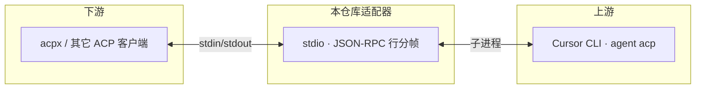

# fzx-cursor-acp

[](https://github.com/limingfa/fzx_cursor_acp)
[](https://www.npmjs.com/package/fzx-cursor-acp)
[](./LICENSE)
[](https://nodejs.org/)

**下游 ACP 客户端 ↔ 上游 Cursor CLI（`agent acp` / `cursor-agent acp`）的 stdio 桥接适配器**，与 [acpx](https://www.npmjs.com/package/acpx) 的 `cursor` harness 配合使用，重点改善 **Windows** 下的稳定性与可配置性。

|  |  |
| --- | --- |
| **仓库** | [github.com/limingfa/fzx_cursor_acp](https://github.com/limingfa/fzx_cursor_acp) |
| **npm 包** | [`fzx-cursor-acp`](https://www.npmjs.com/package/fzx-cursor-acp) |
| **问题反馈** | [Issues](https://github.com/limingfa/fzx_cursor_acp/issues) |

## 目录

- [工作原理](#工作原理)
- [功能特性](#功能特性)
- [快速开始](#快速开始)
- [通过 npm 安装](#通过-npm-安装)
- [前置条件](#前置条件)
- [与 acpx 集成](#与-acpx-集成)
- [第一次使用 sessions new](#第一次使用-acpx-cursor-sessions-new)
- [在 OpenClaw 中引入](#在-openclaw-中引入)
- [可选配置](#可选配置)
- [验收脚本（Windows）](#验收脚本windows)
- [故障排查](#故障排查)
- [许可与贡献](#许可与贡献)
- [联系与作者](#联系与作者)

## 工作原理



- 协议：**JSON-RPC 2.0**，按行写入 `stdout`，日志只走 **`stderr`**，避免污染 ACP 流。
- 适配器负责会话映射、权限策略、上游崩溃重启等；**仍需本机安装并登录 Cursor CLI**。

## 功能特性

- stdio + JSON-RPC 2.0 行分帧桥接
- `cursor-agent acp` / `agent acp` 自动探测（可 `--cursor-command` 覆盖）
- `session/request_permission` 自动策略决策
- 会话 ID 映射与本地持久化
- 上游进程退出自动重启
- 所有日志输出到 `stderr`，避免污染协议流

## 快速开始

```bash
git clone https://github.com/limingfa/fzx_cursor_acp.git
cd fzx_cursor_acp
npm install
npm run build
node dist/main.js
```

开发模式（示例）：

```bash
npm run dev -- --cursor-command agent --permission-mode approve-reads
```

## 通过 npm 安装

```bash
npm install -g fzx-cursor-acp
```

全局安装后可用命令 **`fzx-cursor-acp`**，在 `~/.acpx/config.json` 中：

```json
{
  "agents": {
    "cursor": {
      "command": "fzx-cursor-acp"
    }
  }
}
```

不全局安装时也可用 **`npx`**（首次会拉取包）：

```json
{
  "agents": {
    "cursor": {
      "command": "npx -y fzx-cursor-acp@latest"
    }
  }
}
```

**OpenClaw / 网关里不想写 `fzx-cursor-acp` 的绝对路径时**：优先试 **`npx -y fzx-cursor-acp@latest`**。`npx` 通常与 **`node`** 同目录（例如 `C:\Program Files\nodejs\`），很多服务进程的 `PATH` 里**有 Node、没有** `%AppData%\npm`**，用 `npx` 往往比依赖全局 `fzx-cursor-acp.cmd` 更稳。

要求：**Node.js ≥ 18**，且本机已安装并登录 **Cursor CLI**（见[前置条件](#前置条件)）。

## 前置条件

本适配器会启动 **Cursor CLI** 的 ACP 模式。请确保终端中至少一项可用：

- `agent --version` 或 `cursor-agent --version`
- 未登录时先执行：`agent login`（或按 Cursor 文档配置 API Key）

若命令不在 `PATH`，可在用户目录创建 `~/.cursor-acp-adapter.json`，写入上游可执行文件的**绝对路径**。

**Windows 自动探测（免配置常见场景）：** 若未在配置文件里写 `cursor.command`，适配器会依次尝试：在 **`PATH`** 中查找 `cursor-agent` / `agent`；若仍找不到，再探测 **`%LOCALAPPDATA%\cursor-agent\cursor-agent.cmd`** 与 **`agent.cmd`**（官方安装器常见路径）。仅当安装位置非常规时，才需要手动配置。

**macOS：** 同样先查 **`PATH`**；若未命中，再尝试常见路径 **`/opt/homebrew/bin`**（Apple Silicon Homebrew）、**`/usr/local/bin`**（Intel / 部分安装器）、**`~/.local/bin`**。与 Windows 一样，若 CLI 装在其他目录且不在 `PATH` 中，再在 **`~/.cursor-acp-adapter.json`** 里写 `cursor.command`。

**Windows** 常见安装位置（择一，以本机为准）：

- `%LOCALAPPDATA%\cursor-agent\cursor-agent.cmd`
- `%LOCALAPPDATA%\cursor-agent\agent.cmd`

示例：

```json
{
  "cursor": {
    "command": "C:/Users/你的用户名/AppData/Local/cursor-agent/cursor-agent.cmd"
  }
}
```

适配器对 `.cmd` / `.bat` 在 Windows 上会使用 `shell` 启动，以便正确执行批处理入口。

## 与 acpx 集成

**重要：** acpx（例如 0.3.x）在解析配置时只使用 `agents.<name>.command` 字符串，**不会**使用 `args` 字段。

- **已全局安装：** `"command": "fzx-cursor-acp"`（推荐）。
- **从源码目录运行：** 路径含空格时，将整条命令写进 `command` 并为路径加引号，例如：

```json
{
  "agents": {
    "cursor": {
      "command": "node \"D:/cursor acp/dist/main.js\""
    }
  }
}
```

Windows 上 `~/.acpx/` 一般为 `C:\\Users\\你的用户名\\.acpx\\config.json`。

### 第一次使用 acpx cursor sessions new

**第一次**把本适配器接到 acpx 时，请先执行：

```bash
acpx cursor sessions new
```

**作用说明：**

- 在 acpx 侧为内置 harness 名 **`cursor`** **新建一条 ACP 会话**：acpx 会按 `~/.acpx/config.json` 里的 `agents.cursor.command` **启动本适配器**（如 `fzx-cursor-acp`），适配器再拉起上游 **Cursor CLI** 的 `acp` 子进程，完成协议握手与会话登记。
- 执行成功后，acpx 会持有**当前会话**标识；之后同一会话里的 **`acpx cursor "..."`**、**`acpx cursor status`**、**`acpx cursor exec`** 等命令，都会在这条会话上与 Cursor 交互。
- 若从未执行过 **`sessions new`**，或会话已失效（例如上游崩溃、长时间未用、`agent needs reconnect` 等），后续命令可能报错；此时应 **重新执行 `acpx cursor sessions new`**（必要时先按 acpx 文档关闭旧会话），再重试对话。

**验证与会话内常用命令：**

```bash
acpx cursor sessions new
acpx cursor "hello"
acpx cursor status
acpx cursor exec "one-shot"
```

## 在 OpenClaw 中引入

OpenClaw 通过 **ACP 插件** 与 **acpx** 对接外部编程智能体（参见 [Integrate External Coding Harnesses with OpenClaw ACP](https://open-claw.bot/docs/tools/acp-agents/)）。请先在 **`~/.acpx/config.json`** 中将 `cursor` 指到本适配器（`fzx-cursor-acp` 或 `node .../dist/main.js`），再在 OpenClaw 中声明同一 harness。

### 1. 本机前提

- **Node.js（≥18）**；可用 `npm install -g fzx-cursor-acp` 或克隆本仓库后 `npm install && npm run build`。
- **Cursor CLI** 已安装并完成登录。
- **`~/.acpx/config.json`** 示例（全局安装）：

```json
{
  "agents": {
    "cursor": {
      "command": "fzx-cursor-acp"
    }
  }
}
```

（若从源码运行，仍可使用 `"node \"D:/path/to/repo/dist/main.js\""`。）

### 2. 启用 acpx 插件与 ACP

```bash
openclaw plugins install acpx
openclaw config set plugins.entries.acpx.enabled true
```

并在配置中打开 **ACP**（如 `acp.enabled: true`、`acp.backend: "acpx"`），以当前 OpenClaw 文档为准。

### 3. 在 `agents.list` 中注册（`acp.agent`: `cursor`）

```json
{
  "agents": {
    "list": [
      {
        "id": "cursor",
        "runtime": {
          "type": "acp",
          "acp": {
            "agent": "cursor",
            "backend": "acpx",
            "mode": "persistent",
            "cwd": "D:/cursor acp"
          }
        }
      }
    ]
  }
}
```

- **`id`**：OpenClaw 侧 agent 标识，建议清晰易辨。
- **`acp.agent`**：须为 **`cursor`**，与 acpx 内置名一致。
- **`cwd`**：智能体默认工作目录。

若存在 **`acp.allowedAgents`**，请将 **`cursor`** 加入白名单。

### 4. 验证

- 执行 **`/acp doctor`**，确认 acpx 与健康状态。
- 使用 **`/acp spawn cursor`**（或你配置的 `agentId`）发起会话。

**命令写法：** harness 名 **`cursor` 必须带上**。仅输入 **`/acp spawn`** 会提示需要 *ACP harness id* 或配置 **`acp.defaultAgent`**（例如设为 `cursor`，具体字段以当前 OpenClaw 文档为准）。正确示例：**`/acp spawn cursor`**。

### 5. 说明

OpenClaw 与 **`~/.acpx/config.json`** 需同时正确：前者决定使用哪个 acpx agent 名，后者决定该名对应的启动命令。字段以 [OpenClaw ACP Agents 文档](https://open-claw.bot/docs/tools/acp-agents/) 最新版为准。

## 可选配置

复制 `.cursor-acp-adapter.example.json` 为 `.cursor-acp-adapter.json`（项目级）或 `~/.cursor-acp-adapter.json`（用户级）。

| 参数 | 说明 |
| --- | --- |
| `cursor.command` | 上游 Cursor 命令（`cursor-agent` 或 `agent`） |
| `cursor.args` | 启动附加参数 |
| `permissionMode` | `approve-all` \| `approve-reads` \| `deny-all` |
| `permissionTimeoutMs` | 权限决策超时（ms） |
| `sessionDir` | 会话映射文件目录 |

## 验收脚本（Windows）

```powershell
powershell -ExecutionPolicy Bypass -File ./scripts/verify-acpx.ps1
```

## 故障排查

| 现象 | 处理 |
| --- | --- |
| `agent` / `cursor-agent` 找不到 | 确认 Cursor CLI 已安装且在 `PATH` 中；或使用 `--cursor-command` / `cursor.command` 绝对路径。 |
| `authenticate` 失败 | 执行 `agent login` 或设置 `CURSOR_API_KEY` / `CURSOR_AUTH_TOKEN`（见 Cursor CLI 文档）。 |
| 协议无输出或乱码 | 勿向 `stdout` 打日志；JSON-RPC 只应出现在 `stdout`，日志在 `stderr`。 |
| 上游进程频繁退出 | 查看 `stderr`；可设 `LOG_LEVEL=debug`。崩溃后会重启；若会话失效请 `acpx cursor sessions new`。 |
| `agent needs reconnect` 后出现 `RUNTIME: Invalid params` | 多为 Cursor 侧会话失效。适配器会将 `session/load` 的 `-32602` 映射为 `-32001` 以触发重建；仍失败时请 `sessions new` 或 `sessions close` 后重试。 |
| `command` 含空格 | JSON 中整条字符串加引号，例如 `"node \"D:/cursor acp/dist/main.js\""`。 |
| 终端里 **`acpx cursor "..."` 正常**，OpenClaw 里报 **`ACP_SESSION_INIT_FAILED`** / **`acpx exited with code 1`** | 网关进程与终端的 **环境变量（尤其是 `PATH`）往往不同**：可能找不到 **`fzx-cursor-acp`** 或 **`agent` / `cursor-agent`**。请在 **`~/.acpx/config.json`** 中把 `agents.cursor.command` 改为 **`fzx-cursor-acp.cmd` 的绝对路径**（在 PowerShell 中执行 `where.exe fzx-cursor-acp` 获取）；在 **`~/.cursor-acp-adapter.json`** 中为 **`cursor.command`** 配置 **Cursor CLI 的 `.cmd` 绝对路径**。改完后在聊天中重新 **`/acp spawn cursor`**。 |
| 只输入 **`/acp spawn`** 提示需要 harness id | 使用 **`/acp spawn cursor`**，或在 OpenClaw 中配置 **`acp.defaultAgent`**（若文档支持），见上文「验证」小节。 |

## 许可与贡献

本项目以 **MIT** 许可证发布（见仓库内 [`LICENSE`](./LICENSE)）。

欢迎通过 [Issues](https://github.com/limingfa/fzx_cursor_acp/issues) 反馈问题；若提交 PR，请尽量附带复现步骤与环境说明（OS、Node、acpx / OpenClaw 版本）。

## 联系与作者

**风之馨** 为 **风之馨品牌**创始人，熟悉 **Prompt 提示工程**、**RPA 自动化**，以及 **n8n**、**Coze**、**Dify** 等智能体与应用搭建，并关注 **AI 视频**、**AI 生图** 等方向。长期主张以 **RPA + AI** 组合提升自动化与内容生产效率，**用 RPA + AI 实现高效益创收**。

| 项目 | 内容 |
| --- | --- |
| 联系人 | 风之馨 |
| 身份 | 风之馨品牌创始人 |
| 微信公众号 | **风之馨技术录** |
| 公开联系 | 技术问题请优先通过 [GitHub Issues](https://github.com/limingfa/fzx_cursor_acp/issues)；其它交流可通过公众号。 |

欢迎通过 Issues、公众号交流本适配器、acpx 与 OpenClaw 集成，以及 RPA、智能体与 AI 创作相关实践。
